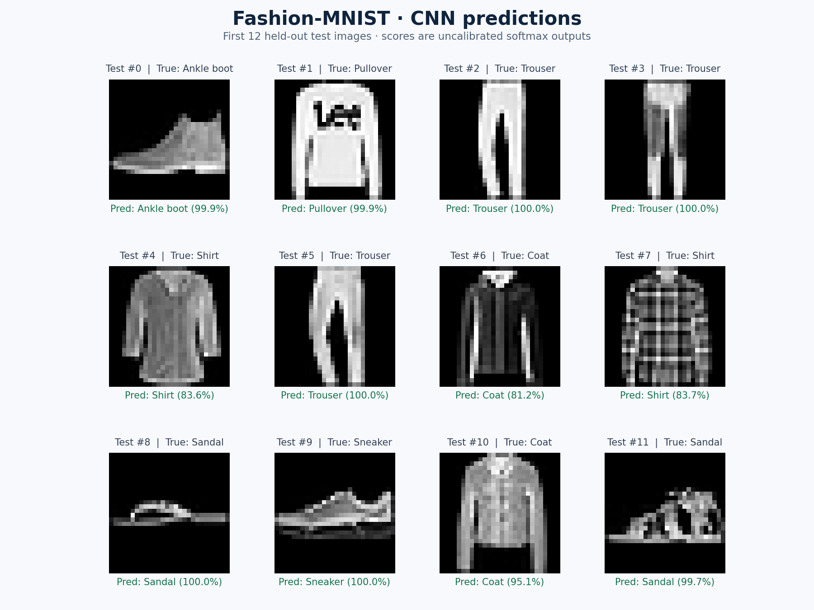
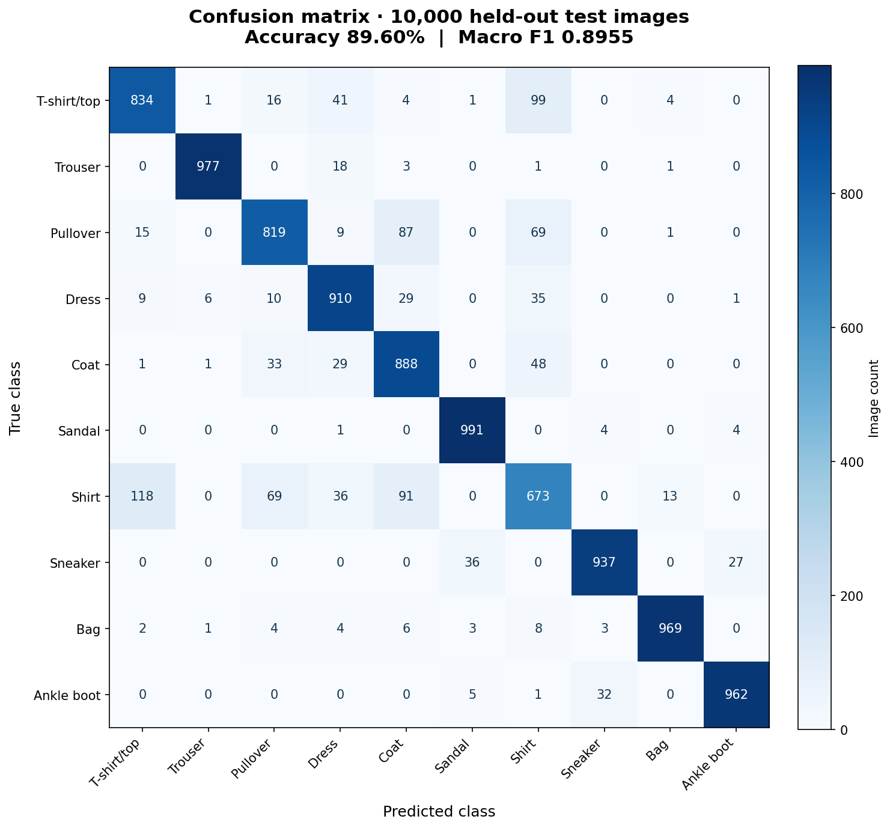

# TensorFlow × Keras 服飾商品影像分類

使用 **Python、TensorFlow／Keras、scikit-learn 與 Streamlit**，完成服飾影像分類原型：從資料切分、CNN 訓練、保留測試集評估，到模型儲存與圖片上傳推論。

附有已訓練模型與範例圖片，安裝環境後即可啟動展示。

## 成果預覽



上圖依測試集原始順序呈現前 12 張影像，並列出真實類別與模型預測；未依預測是否正確挑選。

| 評估項目 | 結果 |
| --- | --- |
| 資料集 | Fashion-MNIST，10 類服飾，28 × 28 灰階影像 |
| 訓練／驗證／測試數量 | 51,000／9,000／10,000 |
| 測試準確率 | **89.60%** |
| 測試 Macro F1 | **0.8955** |
| 訓練回合／隨機種子 | 5／42 |
| 模型選擇方式 | 保留驗證損失最低的 checkpoint |

完整數值見 [metrics.json](artifacts/metrics.json)，各回合紀錄見 [history.csv](artifacts/history.csv)。



Shirt、T-shirt/top、Coat 與 Pullover 是較容易互相混淆的類別。後續可依錯分影像分析輪廓與紋理特徵，並在固定資料切分下比較改善效果。

## 主要功能與技術

- **資料準備**：從原始訓練資料分層切出驗證集，官方測試集獨立保留。
- **CNN 分類**：像素縮放、兩層卷積／池化、全連接層與 Dropout，輸出 10 類 softmax 分數。
- **模型訓練**：Adam、EarlyStopping 與 ModelCheckpoint。
- **模型評估**：Accuracy、Macro F1、各類別 precision／recall 與混淆矩陣。
- **推論介面**：命令列單張推論、Streamlit 圖片上傳、前三名分類結果與內建範例。
- **自訂資料**：支援按類別整理的 train／val／test 影像資料夾；可使用 CNN 或 MobileNetV2 凍結特徵萃取器。

## 快速啟動

已驗證環境：**Python 3.12、TensorFlow CPU 2.21.0**。展示使用附帶模型；重新訓練時，首次執行會下載 Fashion-MNIST。

```bash
git clone https://github.com/gf0927/Fashion-Image-Classification-TensorFlow-Keras.git
cd Fashion-Image-Classification-TensorFlow-Keras
python -m venv .venv
```

啟用虛擬環境：

```powershell
# Windows PowerShell
.\.venv\Scripts\Activate.ps1
```

```bash
# macOS / Linux
source .venv/bin/activate
```

安裝依賴並啟動：

```bash
python -m pip install -r requirements.txt
python -m streamlit run app.py
```

打開終端機顯示的 Local URL，勾選 **Try the included Fashion-MNIST sample**，或上傳專案中的 `sample.png`。此範例來自官方測試集第 0 張影像，真實類別為 **Ankle boot**。上傳自訂影像時，會優先使用上傳內容。

也可在命令列推論：

```bash
python classifier.py predict --image sample.png --output artifacts
```

## 重跑訓練與評估

```bash
python classifier.py train --dataset fashion --epochs 5 --output artifacts_retrained
python classifier.py predict --image sample.png --output artifacts_retrained
python -m streamlit run app.py -- --output artifacts_retrained
```

固定隨機種子與資料切分；不同硬體或套件環境仍可能造成數值差異。模型包含像素縮放，推論時直接使用 0–255 像素值。

輸出包括 `.keras` 模型、類別與前處理設定、訓練紀錄、評估數值與混淆矩陣 CSV。

## 使用自己的商品影像

先依產品實體切分資料；同一件商品的不同角度、裁切或增強版本應留在同一個 split。每個 split 至少包含兩個相同名稱的類別資料夾，例如 `train/bottle`、`train/cable`、`val/bottle`、`val/cable`、`test/bottle`、`test/cable`。

```bash
python classifier.py train --dataset folder --data-dir data/products --epochs 12 --output product_artifacts
python -m streamlit run app.py -- --output product_artifacts
```

加上 `--backbone mobilenet` 可下載 ImageNet 預訓練 MobileNetV2 權重，凍結特徵萃取層並訓練分類頭。此路徑尚未用真實商品資料完成成效評估。

## 檔案說明

| 路徑 | 用途 |
| --- | --- |
| `classifier.py` | 資料載入、模型訓練、評估、圖片推論 |
| `app.py` | Streamlit 圖片上傳與範例展示 |
| `artifacts/model.keras` | 已訓練的 Fashion-MNIST CNN |
| `artifacts/metadata.json` | 類別名稱與輸入格式 |
| `artifacts/metrics.json` | 保留測試集評估結果 |
| `artifacts/history.csv` | 訓練與驗證紀錄 |
| `artifacts/confusion_matrix.csv` | 各類別錯分數量 |
| `docs/` | 真實預測結果圖與混淆矩陣圖 |
| `sample.png` | 官方測試集第 0 張影像 |

## 適用範圍

目前成效來自 **Fashion-MNIST 服飾縮圖分類**。真實商品照片、製造瑕疵與 AOI 場景需要相應資料、標註與獨立測試。介面呈現的是 softmax 分數，尚未進行機率校準。

本專案以 AI 輔助開發完成，公開數值與預測圖均來自實際模型執行結果。

## 資料來源

[Fashion-MNIST](https://github.com/zalandoresearch/fashion-mnist)，Zalando Research。範例圖片與預測圖使用該資料集，授權聲明收錄於 [THIRD_PARTY_NOTICES.md](THIRD_PARTY_NOTICES.md)。
